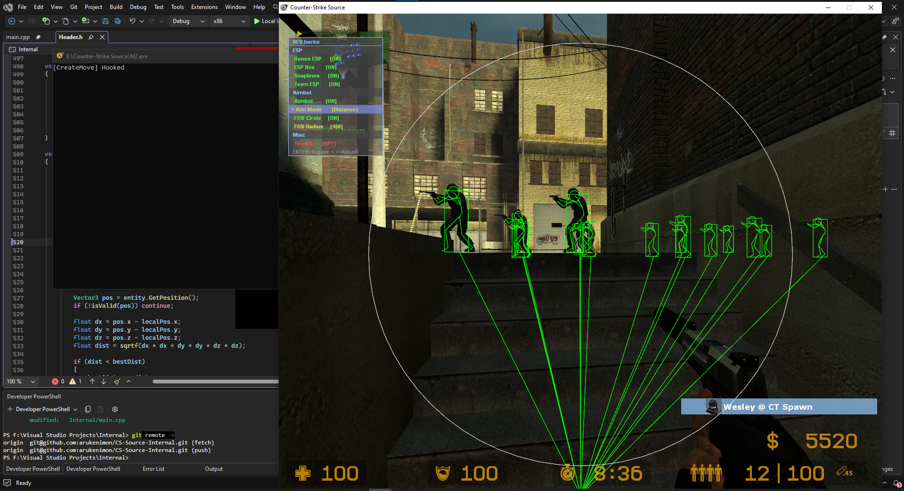

# CS-Source-Internal

Internal DLL cheat for **Counter-Strike: Source**, written in C++.
Renders a D3D9 overlay by hooking `EndScene` and manipulates player input via a `CreateMove` hook.

---

## Preview

---

## How it works

The DLL is injected into `hl2.exe` at runtime. On attach it spins up a thread that:

1. **Hooks `IDirect3DDevice9::EndScene`** - called every rendered frame, used to draw the ESP overlay on top of the game.
2. **Hooks `IBaseClientDLL::CreateMove`** - called every game tick before input is sent to the server, used to silently redirect aim angles when the aimbot is active.

All hooking is done with **Microsoft Detours**.

---

## Features

### ESP Overlay
| Feature | Detail |
|---|---|
| **Bone ESP** | Full skeleton drawn on every valid enemy (and optionally teammates) by reading the bone matrix. Each bone pair is connected with a line. |
| **Head Circle** | Dynamic-radius circle around bone 14 (head). Radius is derived by projecting a point 6 world-units above the head into screen space, so it scales with distance. |
| **FOV Circle** | Static screen-space circle centred on the crosshair showing the aimbot acquisition radius. |
| **Team ESP** | When enabled, teammate skeletons are also drawn in green. Enemies are always red. |

### Aimbot
- **FOV-based target selection** - scans all 63 entity slots, projects each head bone to screen, picks the closest one inside the FOV radius.
- **Angle calculation** - computes pitch/yaw from local eye position to target head in world space, normalises the delta, applies smoothing.
- **Silent aim via `CreateMove`** - final angles are written inside the hooked tick function so the engine sends them without moving the visible crosshair.
- **Hold-to-activate** - only runs while `LSHIFT` is held and the Aimbot toggle is ON in the menu.

### In-game Menu
Toggled at any time with `INSERT`. Rendered as a semi-transparent overlay panel in the top-left corner.

| Key | Action |
|---|---|
| `INSERT` | Open / close menu |
| UP / DOWN | Move selection |
| `ENTER` | Toggle selected item ON / OFF |
| `NUMPAD 0` | Unhook everything and unload the DLL cleanly |

---

## Memory Layout (CS:S)

| Field | Address / Offset |
|---|---|
| Entity list | `client.dll + 0x004E5B14` |
| View matrix pointer | `client.dll + 0x004FF224 + 0x50` |
| View angles pointer | `engine.dll + 0x000A5904` |
| Health | `entity + 0x8C` |
| Team | `entity + 0x94` |
| Origin (XYZ) | `entity + 0x258` |
| Bone matrix pointer | `entity + 0x570` |
| Dormant flag | `entity + 0xE8` |

> Offsets may drift after game updates - use Cheat Engine to reverify.

---

## Build

**Requirements**
- Visual Studio (x86 build tools)
- DirectX SDK (June 2010 or compatible)
- Microsoft Detours

**Steps**
1. Clone the repo
2. Open `Internal.slnx` in Visual Studio
3. Set configuration to **Release / x86**
4. Build - output is a 32-bit `.dll`
5. Inject into `hl2.exe` with any standard DLL injector

---

## Disclaimer

This project exists for **educational purposes** - understanding D3D hooking, memory reading, and game engine internals.
Using cheats in online games violates the Terms of Service and will result in a ban.
Do not use this in any live online environment.
